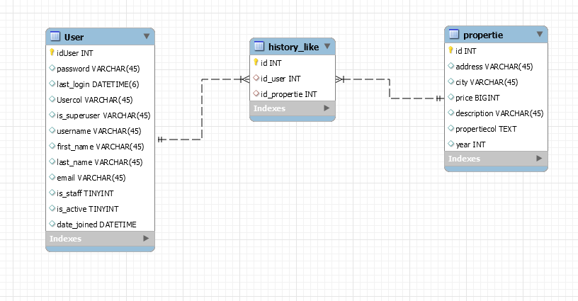

# Habi
Se realiza la creacion del repositorio primero se validara la base de datos para enteder el modelamiento de esta y se usara python junto al plugin de fastApi

### Primer requerimiento
*. *Filtrar por estados y columnas*
   R/: **Se busca las tablas involucradas para realizar los respectivos joins y despues de ello se empieza a armar el como seria los posibles filtros que lleguen se deja en una lista de filtros y un campo other para saber si viene segunda consula o no como un or o and se dejaron los filtros mas utilizados para los campos**
*. *Aplicar varios filtros*
    R/: **Se empieza a revisar la lsita para ir armando los filtros cada vez va llegando una petición y sea autonomo**
### Segundo requerimiento
*. El diagrama lo veo parecido al que se tiene para la historia de estados de las propiedades
   

   Como se observa el diagrama es una tabla con referencia a la propiedad y a el usuario se realizo asi ya que por el indice
   la consulta funciona mucho mas optimo, ya en un proyecto anterior se uso la un campo json donde se almacenaba toda la historia
   esto empezo a fallar y dar cierto complejos en las consultas y la opción que mas no dio resultado fue el crear la tabla de esta manera
   referenciada a tablas principales mediante llaves foraneas y por indices

* El query que se usaria para la creación de la tabla seria
*CREATE TABLE `history_like` (
   `id` int(11) NOT NULL AUTO_INCREMENT,
   `id_user` int(11) NOT NULL,
   `id_propertie` int(11) NOT NULL,
   PRIMARY KEY (`id`),
   UNIQUE KEY `status_historial_like_id_uindex` (`id`),
   KEY `status_historial_property_id_fk` (`id_propertie`),
   KEY `status_historial_user_id_fk` (`id_user`),
   CONSTRAINT `status_historial_property_id_fk` FOREIGN KEY (`id_propertie`) REFERENCES `property` (`id`),
  CONSTRAINT `status_historial_user_id_fk` FOREIGN KEY (`id_user`) REFERENCES `auth_user` (`id`)
   ) ENGINE=InnoDB AUTO_INCREMENT=81 DEFAULT CHARSET=latin1;